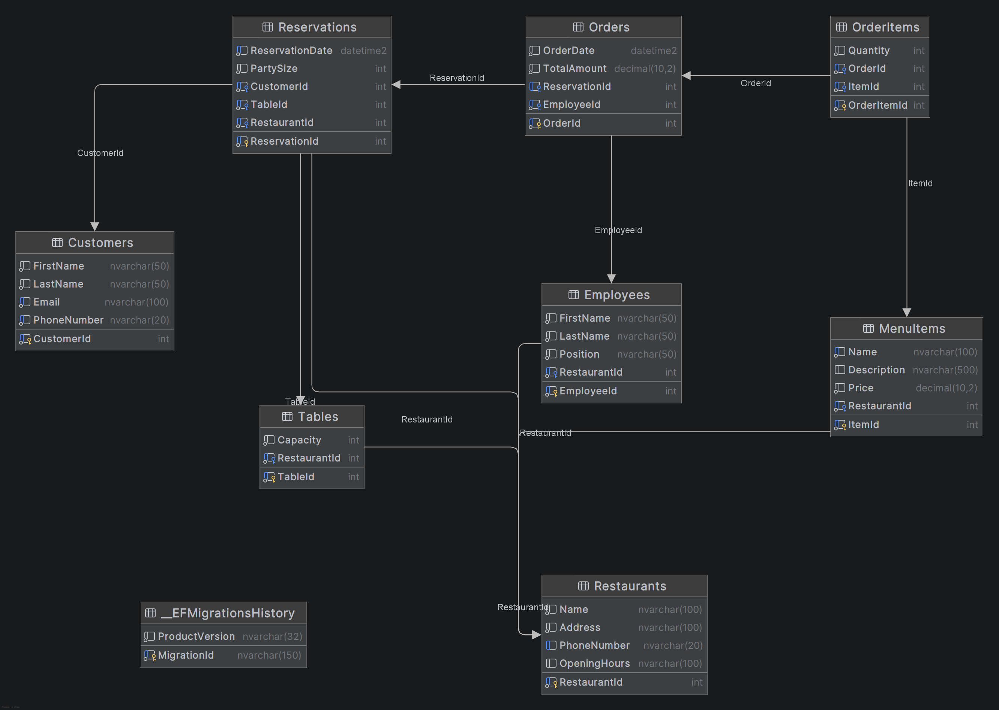

# Restaurant Reservation System

A console-based restaurant reservation management system built with .NET 10, Entity Framework Core, and SQL Server. The application provides a rich interactive UI powered by Spectre.Console for managing restaurants, customers, reservations, orders, employees, tables, and menu items.

---

## Table of Contents

- [Architecture](#architecture)
- [Project Structure](#project-structure)
- [Tech Stack](#tech-stack)
- [Prerequisites](#prerequisites)
- [Getting Started](#getting-started)
- [Database Setup](#database-setup)
- [Running the Application](#running-the-application)
- [Application Features](#application-features)
- [Entity Relationship Diagram](#entity-relationship-diagram)
- [Database Objects](#database-objects)
- [Design Patterns](#design-patterns)

---

## Architecture

The project follows **Clean Architecture** with three distinct layers:

```
RestaurantReservation (Startup)
│
├── RestaurantReservation.Domain          (Entities, Enums - no dependencies)
├── RestaurantReservation.Infrastructure  (EF Core, Repositories, Seeders)
├── RestaurantReservation.UI              (Console UI with Spectre.Console)
```

- **Domain Layer** -- Pure entities and enums with no external dependencies.
- **Infrastructure Layer** -- Data access using EF Core, Repository pattern, Unit of Work, seeders, and database configurations.
- **UI Layer** -- Console-based user interface with interactive menus and Spectre.Console for rich terminal output.

---

## Project Structure

```
RestaurantReservation/
├── RestaurantReservation.sln
├── RestaurantReservation/                        [Startup Project]
│   ├── Program.cs                                (Entry point, DI setup)
│   ├── RestaurantReservation.csproj
│   └── appsettings.json                          (Connection string)
│
├── RestaurantReservation.Domain/                 [Domain Layer]
│   ├── Enums/
│   │   └── Position.cs
│   └── Entities/
│       ├── Restaurant.cs
│       ├── Table.cs
│       ├── Customer.cs
│       ├── Employee.cs
│       ├── Reservation.cs
│       ├── Order.cs
│       ├── OrderItem.cs
│       ├── MenuItem.cs
│       ├── Views/
│       │   ├── ReservationDetailsView.cs
│       │   └── EmployeeRestaurantDetailsView.cs
│       └── Procedures/
│           └── CustomerReservationProcedure.cs
│
├── RestaurantReservation.Infrastructure/         [Infrastructure Layer]
│   ├── Db/
│   │   ├── RestaurantReservationDbContext.cs
│   │   ├── Functions/                            (SQL scalar functions)
│   │   └── Mappings/                             (EF Core mappings)
│   ├── Configurations/                           (Fluent API entity configurations)
│   ├── IRepositories/                            (Repository interfaces)
│   ├── Repositories/                             (Repository implementations)
│   ├── Interfaces/                               (IUnitOfWork)
│   ├── Implementations/                          (UnitOfWork)
│   ├── Seeders/                                  (Data seeders)
│   └── Migrations/                               (EF Core migrations)
│
├── RestaurantReservation.UI/                     [UI Layer]
│   ├── RestaurantReservationConsole.cs           (Main console orchestrator)
│   ├── Common/
│   │   ├── Ui.cs                                 (Shared UI helpers)
│   │   └── EntitySelector.cs                     (Reusable entity selectors)
│   └── Features/
│       ├── DashboardConsole.cs
│       ├── Customers/CustomerConsole.cs
│       ├── Restaurants/RestaurantConsole.cs
│       ├── Tables/TableConsole.cs
│       ├── Employees/EmployeeConsole.cs
│       ├── MenuItems/MenuItemConsole.cs
│       ├── Reservations/ReservationConsole.cs
│       └── Orders/OrderConsole.cs
```

---

## Tech Stack

| Component | Technology |
|---|---|
| Runtime | .NET 10.0 |
| Language | C# (nullable, implicit usings) |
| Database | Microsoft SQL Server |
| ORM | Entity Framework Core 10.0 |
| Console UI | Spectre.Console 0.56.0 |
| Bulk Operations | EFCore.BulkExtensions 10.0 |
| Configuration | Microsoft.Extensions.Configuration |

---

## Prerequisites

- [.NET 10 SDK](https://dotnet.microsoft.com/download/dotnet/10.0) or later
- [SQL Server](https://www.microsoft.com/en-us/sql-server) (LocalDB, Express, or full instance)
- An IDE such as [JetBrains Rider](https://www.jetbrains.com/rider/), Visual Studio, or VS Code

---

## Getting Started

### 1. Clone the repository

```bash
git clone https://github.com/darxx03eh/RestaurantReservation.git
cd RestaurantReservation
```

### 2. Verify the connection string

Edit `RestaurantReservation/appsettings.json` if your SQL Server instance uses a different name:

```json
{
  "ConnectionStrings": {
    "RestaurantReservationDbLocalConnection": "server=localhost;database=RestaurantReservationCore;Trusted_Connection=True;TrustServerCertificate=True;"
  }
}
```

Change `server=localhost` to your SQL Server instance name if needed (e.g., `server=.\\SQLEXPRESS`).

---

## Database Setup

### Apply Migrations

The project uses EF Core Code-First migrations. Apply them with one of the following methods:

**Option A: .NET CLI**

```bash
dotnet ef database update --project RestaurantReservation.Infrastructure --startup-project RestaurantReservation
```

**Option B: Package Manager Console (Visual Studio)**

```powershell
Update-Database -Project RestaurantReservation.Infrastructure -StartupProject RestaurantReservation
```

This will create the `RestaurantReservationCore` database with all tables, views, functions, and stored procedures.

---

## Running the Application

### Build and run

```bash
dotnet run --project RestaurantReservation
```

Or build the entire solution first:

```bash
dotnet build
dotnet run --project RestaurantReservation/RestaurantReservation.csproj
```

### Main Menu

When the application starts, you will see a Figlet text banner "Reservations" followed by an interactive selection menu:

```
? Select an option:
  > Show dashboard
    Customers
    Restaurants
    Tables
    Employees
    Menu items
    Reservations
    Orders
    Exit
```

Use the arrow keys to navigate and press Enter to select.

---

## Application Features

### Dashboard

Displays a summary grid with counts of all entities in the system:
- Total restaurants, customers, tables, employees, menu items, reservations, and orders.

### Customers

| Operation | Description |
|---|---|
| **List customers** | View all registered customers in a formatted table |
| **Create customer** | Add a new customer (first name, last name, email, phone) |
| **Update customer** | Modify existing customer information |
| **Delete customer** | Remove a customer from the system |
| **Customers by party size** | Query customers by party size using the `sp_GetCustomersByPartySize` stored procedure |

### Restaurants

| Operation | Description |
|---|---|
| **List restaurants** | View all restaurants with details |
| **Create restaurant** | Add a new restaurant (name, address, phone, opening hours) |
| **Show revenue** | Calculate total revenue for a restaurant using the `fn_GetRestaurantTotalRevenue` scalar function |

### Tables

| Operation | Description |
|---|---|
| **List tables** | View all tables with capacity and restaurant info |
| **Create table** | Add a table to a restaurant (select restaurant, set capacity) |

### Employees

| Operation | Description |
|---|---|
| **List employees** | View all employees with position and restaurant info |
| **Employee restaurant details** | Query the `vw_EmployeeRestaurantDetails` database view |

### Menu Items

| Operation | Description |
|---|---|
| **List menu items** | View all menu items with prices and restaurant info |
| **Create menu item** | Add a menu item to a restaurant (select restaurant, set name, description, price) |

### Reservations

| Operation | Description |
|---|---|
| **List reservations** | View all reservations with details |
| **Create reservation** | Book a reservation (select customer, restaurant, table, party size, date) |
| **Reservation details** | Query the `vw_ReservationsWithCustomerAndRestaurant` database view |

### Orders

| Operation | Description |
|---|---|
| **List orders with menu items** | View orders with their associated menu items for a selected reservation |
| **Create order** | Create an order for a reservation (select reservation, employee, add menu items with quantities) |

---

## Entity Relationship Diagram



### Database Tables

| Table | Key Columns | Constraints |
|---|---|---|
| **Customers** | CustomerId, FirstName, LastName, Email, PhoneNumber | Unique Email, Unique Phone |
| **Restaurants** | RestaurantId, Name, Address, PhoneNumber, OpeningHours | Unique Phone |
| **Tables** | TableId, Capacity, RestaurantId | Capacity > 0 and <= 20, Cascade delete |
| **Employees** | EmployeeId, FirstName, LastName, Position, RestaurantId | Position enum values, Cascade delete |
| **Reservations** | ReservationId, ReservationDate, PartySize, CustomerId, TableId, RestaurantId | PartySize > 0, Unique(TableId, Date) |
| **Orders** | OrderId, OrderDate, TotalAmount, ReservationId (nullable), EmployeeId | TotalAmount >= 0, SetNull on reservation delete |
| **MenuItems** | ItemId, Name, Description, Price, RestaurantId | Price > 0, Unique(RestaurantId, Name) |
| **OrderItems** | OrderItemId, Quantity, OrderId, ItemId | Quantity > 0, Unique(OrderId, ItemId) |

---

## Database Objects

### Views

1. **`vw_ReservationsWithCustomerAndRestaurant`** -- Joins reservations with customers and restaurants, displaying reservation details along with customer name/phone and restaurant name/address.

2. **`vw_EmployeeRestaurantDetails`** -- Joins employees with restaurants, displaying employee name/position and restaurant details (name, address, phone, hours).

### Scalar Function

- **`fn_GetRestaurantTotalRevenue(@RestaurantId INT)`** -- Returns the total revenue for a restaurant by summing `Quantity * Price` across all related orders, order items, and menu items.

### Stored Procedure

- **`sp_GetCustomersByPartySize(@PartySize INT)`** -- Returns customers whose reservations have a party size greater than the specified value.

---

## Design Patterns

| Pattern | Implementation |
|---|---|
| **Generic Repository** | `IGenericRepository<T>` / `GenericRepository<T>` -- base CRUD operations for all entities |
| **Unit of Work** | `IUnitOfWork` / `UnitOfWork` -- aggregates all repositories, single `SaveChangesAsync()` |
| **Clean Architecture** | Domain, Infrastructure, UI layers with unidirectional dependencies |
| **Code-First Migrations** | EF Core Fluent API configurations with `IEntityTypeConfiguration<T>` |
| **Bulk Operations** | `EFCore.BulkExtensions` for efficient bulk insert/update/delete |

---

## Employee Positions (Enum)

| Position | Description |
|---|---|
| Manager | Restaurant manager |
| Chef | Kitchen staff |
| Waiter | General wait staff |
| VipOrdersWaiter | VIP section waiter |
| StandardWaiter | Standard dining waiter |
| AssistantWaiter | Assistant/support wait staff |
| Cashier | Handles payments |
| Host | Greets and seats guests |
| Cleaner | Maintenance staff |
